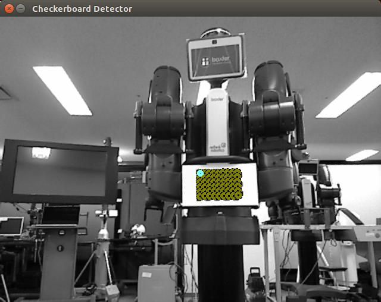

### Calibration using Kinect

```
$ roslaunch baxter_seminar_helper kinect_checkerboard.launch
```

This internally uses `openni` to access the camera device. 

 If this ends with error like the following,:
 
 ```
[ INFO] [1430362116.895948502]: Initializing nodelet with 4 worker threads.
process[camera/driver-3]: started with pid [13937]
[ INFO] [1430362116.991885646]: No devices connected.... waiting for devices to be connected
:
[ INFO] [1430362119.992091656]: No devices connected.... waiting for devices to be connected
```[ INFO] [1430362122.992269550]: No devices connected.... waiting for devices to be connected
[ INFO] [1430362128.992639848]: No devices connected.... waiting for devices to be connected
[ INFO] [1430362131.992814348]: No devices connected.... waiting for devices to be connected
:
 ```

 Then then you can try `freenect`:

 ```
 $ roslaunch baxter_seminar_helper kinect_checkerboard.launch launch_openni:=false
 ```

If successful, you'll see a window like this pops up. Yellow bubbles on the checkerboard means it's recognized and calibrated.




